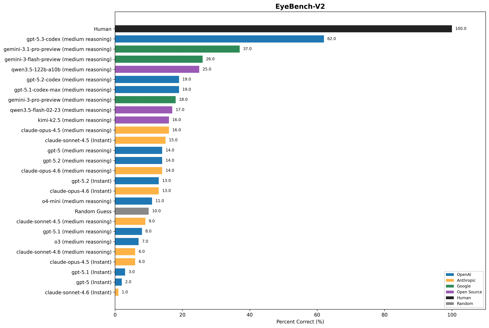

# EyeBench v2

Micro-benchmark for evaluating vision models on one task:
counting line intersections in synthetic images.



The runner uses OpenRouter-compatible chat completions and writes one run
summary per model to `runs/<run_slug>/summary.json`.

## What This Repo Contains

- `main.py` - benchmark runner (async, retry, concurrency, cost + accuracy metrics)
- `scripts/generate-imgs.py` - synthetic dataset generator (`1.png..N.png` + `truth.txt`)
- `scripts/graph-maker.py` - graph generator from run summaries
- `scripts/fix-costs.py` - recalculate `estimated_cost` from `token_usage`
- `scripts/build-web-data.py` - generates `web/src/data/benchmark-data.json` from runs
- `config/model_prices.json` - optional local pricing overrides
- `web/` - interactive results viewer (Vite + React)

## Quick Start

### 1) Install

```bash
pip install -r requirements.txt
```

### 2) Set API key

```bash
export OPENROUTER_API_KEY=sk-or-...
```

### 3) Run benchmark

```bash
python main.py --model openai/gpt-4o
```

## Common Commands

Run one model:

```bash
python main.py --model openai/o3
```

Run multiple models sequentially:

```bash
python main.py --models openai/o3 openai/o4-mini openai/gpt-5
```

Enable reasoning (global default):

```bash
python main.py --model openai/o3 --reasoning-effort medium
```

Override reasoning per model:

```bash
python main.py --models \
  openai/o3:reasoning=high \
  openai/o4-mini:reasoning=none
```

## CLI (main.py)

Key flags and defaults:

- `--model` default: `qwen/qwen3-vl-235b-a22b-instruct`
- `--models` default: `None`
- `--imgs` default: `imgs`
- `--truth` default: `truth.txt`
- `--n` default: auto-detect from `--imgs`
- `--concurrency` default: `4`
- `--request-timeout` default: `3600`
- `--max-retries` default: `5`
- `--rate-limit-backoff` default: `5.0`
- `--model-delay` default: `60`
- `--base-url` default: `https://openrouter.ai/api/v1`
- `--reasoning-effort` default: `None`
- `--log-level` default: `INFO`
- `--log-file` default: `None`
- `--progress` default: `False`
- `--no-tui` / `--no-color` / `--verbose`

## Run Output Format

Each run writes `runs/<run_slug>/summary.json` with:

- `model`, `model_label`, `benchmark_label`, `run_slug`, `timestamp`
- `params` (run configuration)
- `summary` (accuracy, MAE, latencies, throughput, total time, cost)
- `token_usage` (prompt/completion/total aggregated across the run)
- `price` (input/output per million + estimated cost)
- `items` (per-question essentials only):
  - `index`, `truth`, `pred`, `correct`, `latency_s`, `error`, `llm_output`

This keeps per-item data readable while avoiding heavy raw API payload storage.

## Pricing

Edit `config/model_prices.json` with USD-per-million token prices:

```json
{
  "openai/o3": { "input": 2.0, "output": 8.0 },
  "openai/o4-mini": { "input": 1.1, "output": 4.4 }
}
```

Resolution order:

1. Local `config/model_prices.json`
2. Previous run summary price for same model
3. OpenRouter `/models` pricing (when available)
4. Environment defaults (`OPENROUTER_DEFAULT_*`)

## Dataset Generation

Generate images + truth labels:

```bash
python scripts/generate-imgs.py 100 -o imgs -s 42
```

## Graphs

Generate graphs from `runs/`:

```bash
python scripts/graph-maker.py --runs runs --output-dir graphs
```

Outputs:

- `graphs/benchmark.jpg`
- `graphs/cost_vs_accuracy.jpg`
- `graphs/reasoning_time_vs_performance.jpg`

## Interactive Results Viewer

An interactive web UI lives in `web/`. It reads from the auto-generated
`web/src/data/benchmark-data.json` and provides a sortable leaderboard,
interactive charts, per-model detail panels, and an image viewer.

### Regenerate data from runs

```bash
python scripts/build-web-data.py
```

### Local development

```bash
cd web
npm install
npm run dev
```

### Deploy to Netlify

Connect the repo and set the base directory to `web/`. The `netlify.toml`
handles build command and publish directory automatically.

Or deploy manually:

```bash
cd web && npm run build
# Upload web/dist/ to any static host
```

## Notes

- Use vision-capable models; text-only models will fail or return unusable outputs.
- Keep concurrency modest to reduce 429/rate-limit retries.
- Use `--n 5` for smoke tests.
